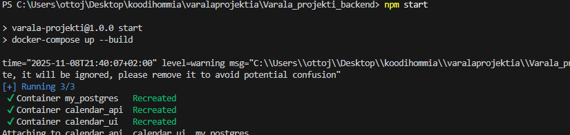
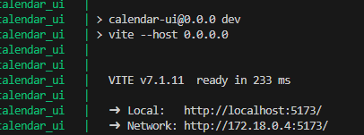
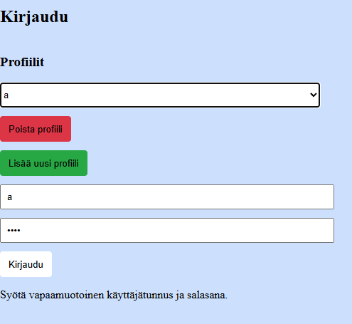
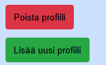
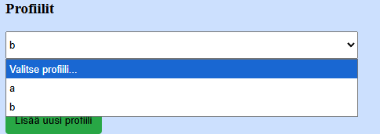
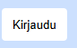
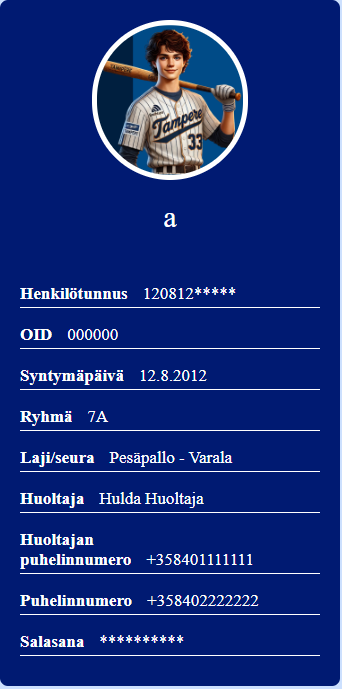
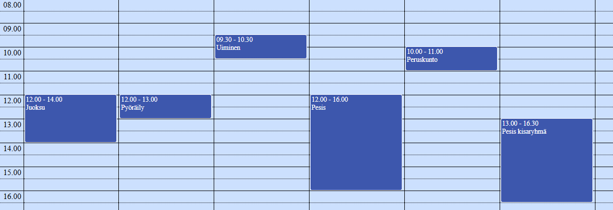
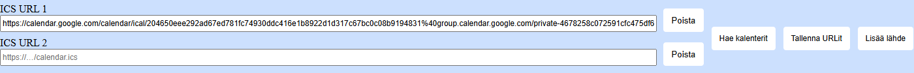

# Varala_projekti_backend

🗓️ Kalenteri-demo (ICS → FullCalendar)

Tämä projekti on yksinkertainen ICS-kalenterien lukija ja näyttäjä.
Se koostuu kahdesta osasta:

Backend (Node.js / Express): Lukee .ics-kalenteritiedostoja verkosta (webcal/http/https) ja muuntaa ne JSON-muotoon.

Frontend (React / FullCalendar): Näyttää kalenteritapahtumat selaimessa visuaalisessa viikkonäkymässä.

🚀 Toiminnot

Voi tallentaa eri profiileille omat lukujärjestykset, lisätä ja poistaa lukujärjestyksiä. [Siirry kohtaan Ohjelman käyttö](#ohjelman-käyttö)

Syötä yksi tai kaksi ICS-linkkiä (esim. Google Calendar tai Outlookin kalenterin julkinen linkki).

Sovellus hakee tapahtumat backendin kautta ja näyttää ne FullCalendarissa.

Jos linkkejä ei anneta, näytetään demotapahtumat (Treeni ja Ottelu).


🛠️ Asennus ja käynnistys

**Asennettuna pitää olla Docker Desktop, että ohjelman saa auki komentokehotteesta. Myös github pitää olla käytössä**

1. Kloonaa projekti

    `git clone https://github.com/Yo455/Varala_projekti_backend.git` ja sitten `cd Varala_projekti_backend`

    Oikeaan branchiin pääsee git checkout komennolla `git checkout <branchin nimi>`. Tällä hetkellä branchissa `main` on toimiva versio lokaalisti (varmista, että Varala_projekti_backend kansio)

2. Asenna riippuvuudet

    `npm install` (asennus pitää tehdä alikansiossa Varala_projekti_backend)


4. Käynnistä sovellus

    Aja komento `npm start` (käynnistys pitää tehdä alikansiossa Varala_projekti_backend)

    

    selaimeen ohjelman saa auki localhost kohdasta seuraamalla linkkiä:
    


## Ohjelman käyttö

### Kirjautuminen

Ohjelman käynnistyttyä käyttäjä pääsee kirjautumisivulle:  


Kirjautumissivulla voi lisätä ja poistaa profiileja:  


Lisätyistä profiileista pääsee valitsemaan sen profiilin, jolla kirjaudutaan:  


Kirjautumisnapilla pääsee kalenterinäkymään:  


### Kalenterin käyttö

Kalenterinäkymässä näkyy profiilin opiskelija(placeholder) ja lukujärjestys:  




Linkkejä pystyy lisäämään kalenterisivun ylälaidassa:  


`Lisää lähde` painikkeella saa lisättyä lisää urleja = lisää kalentereita.

### Virheilmoitukset

### Tarkastele tietokantaa

Komennolla

```bash
docker exec -it my_postgres psql -U myuser -d mydb
```

pääsee katsomaan tietokantaa komentokehotteen kautta. Voi tarkastella tallennettuja url-linkkejä komennon

```sql
select * from saved_urls;
```

avulla. **Pitää muistaa tallentaa urlit, ennen kuin ne näkyvät**


